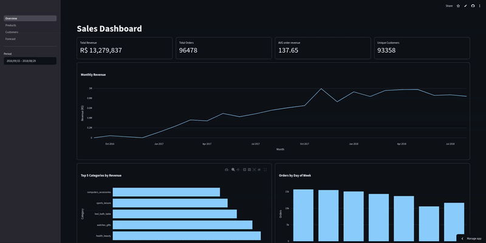
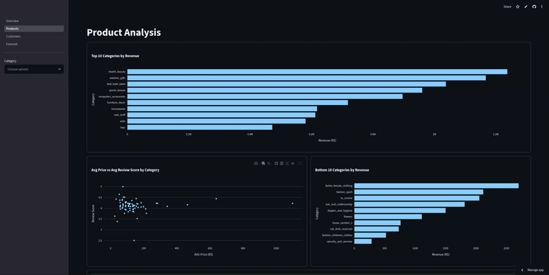
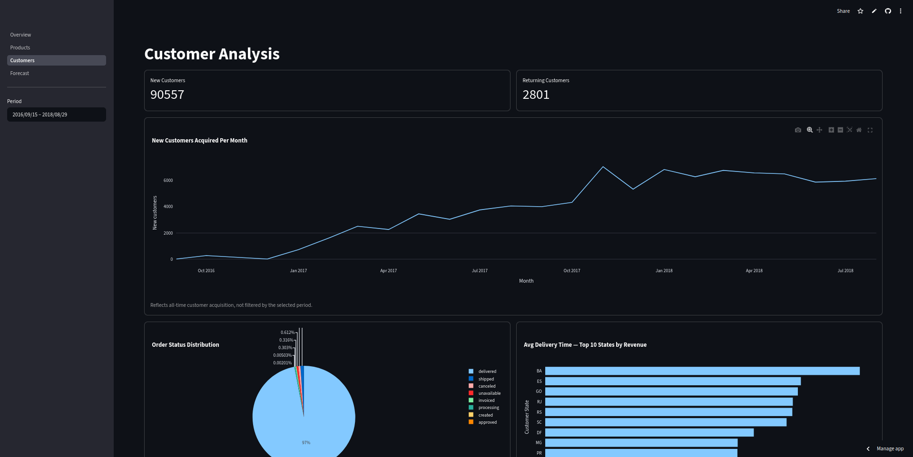
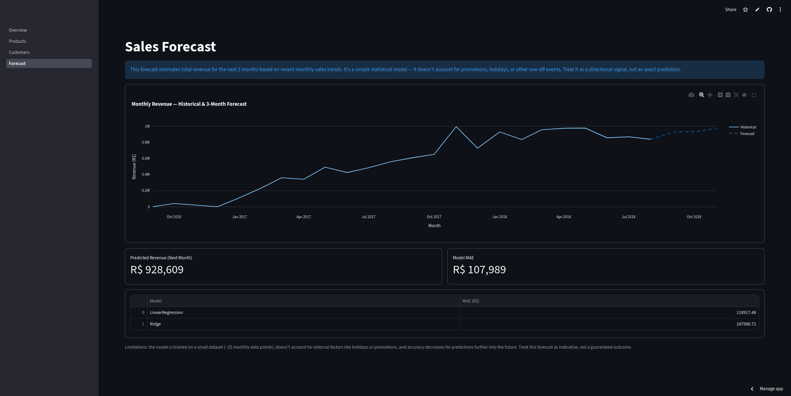

# E-Commerce Sales & Forecast Dashboard

An interactive Streamlit dashboard for exploring sales trends, product performance, customer behavior, and a short-term revenue forecast, built on the Brazilian Olist e-commerce dataset.

**Live demo:** https://ecommerce-dashboard-jjqt3rywhh6gl9ukyaagfl.streamlit.app/

> The app is hosted on Streamlit Community Cloud's free tier and may take a few seconds to wake up on first load.

## Dashboard

### Overview
Revenue, orders, AOV and unique-customer KPIs, monthly revenue trend, top categories, and orders by day of week. The date filter recalculates every KPI and chart on the page.



### Products
Revenue by category, average price vs. average review score, and top / bottom performing categories. Select categories to focus the charts on a subset.



### Customers
New vs. returning customers, monthly customer acquisition, order status breakdown, and revenue and delivery time by state.



### Forecast
A 3-month revenue forecast based on a Ridge regression model trained on historical monthly revenue.



## Exploratory Analysis & Modeling

The full data exploration, feature engineering, and model evaluation live in **[`notebooks/eda.ipynb`](notebooks/eda.ipynb)** — readable as a document, with markdown explanations alongside each step. It covers data quality checks, time / product / customer analysis, lag-feature engineering, the time-based train/test split, and the LinearRegression vs. Ridge comparison that selected the final model.

## Business Questions This Dashboard Answers

- How is monthly revenue trending, and how many orders and unique customers does that represent?
- Which product categories generate the most (and least) revenue?
- Is there a relationship between a category's average price and its average customer review score?
- What share of customers are repeat buyers vs. new, and how fast is the customer base growing month over month?
- Which states generate the most revenue, and how does delivery speed vary by region?
- Based on recent trends, what revenue can be expected over the next 3 months?

## Forecasting Approach

Monthly revenue is aggregated into a time series, then 3 lag features (revenue from 1, 2 and 3 months ago) are used to predict the next month. The train/test split is time-based (first 80% of months for training, last 20% for testing) rather than random, since a random split would leak future information into training. LinearRegression and Ridge are compared by MAE on the test set — Ridge performed better after scaling the features with `StandardScaler`, and was selected as the final model. Forecasting beyond the historical window is done recursively: each prediction is fed back in as the next month's lag feature.

The forecast is intentionally framed as a directional signal, not an exact prediction — it's trained on a small dataset (~25 monthly points) and doesn't account for promotions, holidays, or other external factors.

## Tech Stack

- **Python** — data processing
- **pandas** — data loading, merging, aggregation
- **Plotly Express** — interactive charts
- **Streamlit** — dashboard framework
- **scikit-learn** — Ridge / LinearRegression forecasting model
- **joblib** — model serialization

## How to Run Locally

```bash
git clone https://github.com/yaroslav-hezei/ecommerce-dashboard.git
cd ecommerce-dashboard
pip install -r requirements.txt
streamlit run Overview.py
```

Or, using [uv](https://github.com/astral-sh/uv) for faster, reproducible installs from the lock file:

```bash
git clone https://github.com/yaroslav-hezei/ecommerce-dashboard.git
cd ecommerce-dashboard
uv sync
uv run streamlit run Overview.py
```

The dataset CSVs are committed to the repo, so no manual download is needed.

## Project Structure

```
.
├── Overview.py              # main page — KPIs & sales overview
├── pages/
│   ├── 1_Products.py
│   ├── 2_Customers.py
│   └── 3_Forecast.py
├── utils.py                 # cached data loading, merging, model loading
├── models/                  # serialized Ridge model + scaler
├── notebooks/
│   └── eda.ipynb            # exploration & model training
├── data/                    # Olist CSVs + data README
└── .streamlit/config.toml   # theme
```

## Dataset

Brazilian E-Commerce Public Dataset by Olist
Source: https://www.kaggle.com/datasets/olistbr/brazilian-ecommerce
License: CC BY-NC-SA 4.0 — see [`data/README.md`](data/README.md) for details on which files are used.